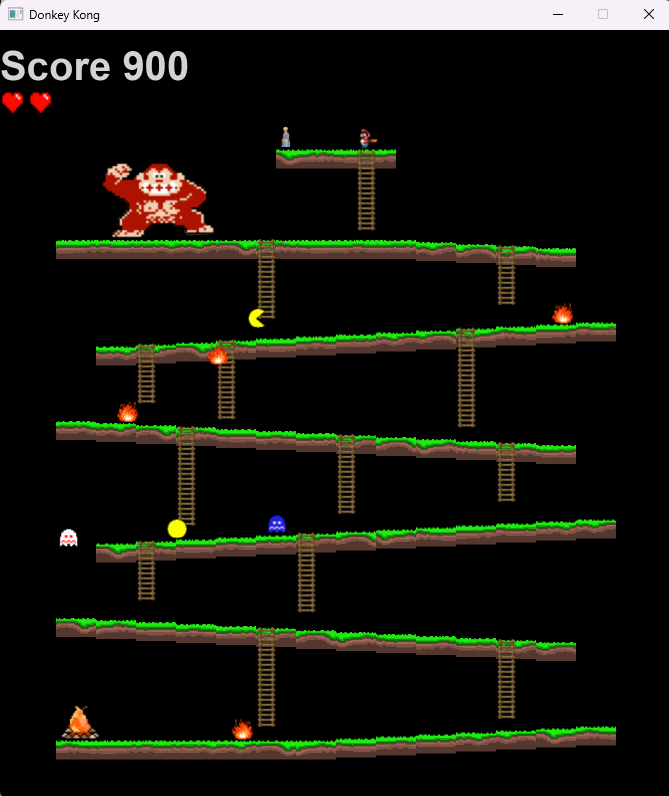

# Donkey Kong

## Overview
This is a simple JavaFX clone of the classic Donkey Kong arcade game, made as
a semester project for the Java I course at VSB-TUO. The goal is to get Mario
up the platforms to the princess while dodging rolling barrels and fireballs.

## Build and Run
To run the game, ensure JDK 17 and Maven are installed and execute:

    mvn javafx:run

The game can also be started from an IDE by running the `lab.App` class.

## Controls
- `Left` / `Right` - walk
- `Up` / `Down` - climb ladders
- `Space` - jump

## Rules
- Jumping over a barrel or a fireball gives 100 points.
- Reaching the princess gives 1000 points and wins the game.
- Touching a barrel, a fireball or Donkey Kong costs one life. Mario has three.
- Barrels burn out in the fire at the bottom. Special barrels release a new
  fireball when they burn.

## License
This project is authored by Demid Ostiakov. All rights reserved.

## Acknowledgments
Thanks to the instructors of the Java I course at VSB-TUO:

- Ing. David Ježek, Ph.D. for the lectures
- Ing. Jan Janoušek for leading the exercises
- Ing. Jan Kožusznik, Ph.D. for the [lab templates](https://github.com/kozusznik) this project is based on
